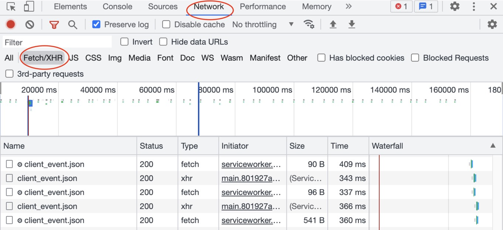
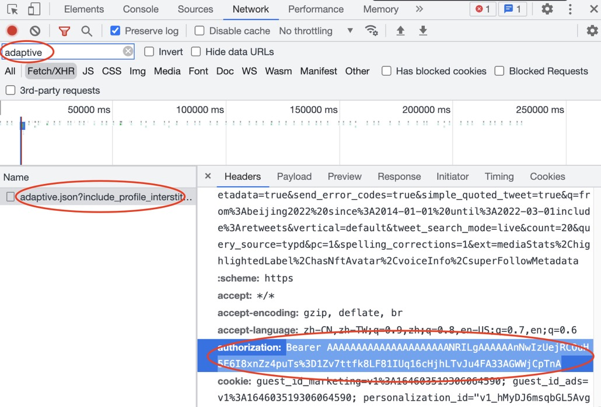

# TwitterCrawler

## Introduction

轻量、快速的推特爬虫脚本，1分钟可以爬取1200+推文

不采用selenium技术路线，后台挂起爬取更稳定

不需要注册推特开发者平台，不需要tweepy包，没有3200条推文的爬取限制

希望这个脚本能够帮你少走许多开发Twitter爬虫的弯路

祝使用愉快！

## Requirements

- Environment: Linux/MacOS/Windows
- Python 3.6+
- 在终端输入一下命令：`pip install -r requirements.txt`

## Easy Tutorial

### 1. 配置网络请求信息 伪装浏览器访问

打开浏览器，访问你想爬取的Twitter网页

按fn+f12，打开浏览器检查工具，点击上方Network，筛选类型为Fetch/XHR

在搜索框中输入adaptive，找到筛选后的请求（如果有多个随便选一个就可以了）

复制里面的"authorization"和"x-guest-token"信息，填写到程序相应的提示位置

第一步，结束！

### 2. 填写你的爬取筛选条件

按照你想爬取的推文条件，分别填写到程序的username、since_date、until_date变量中，其中date的格式为'yyyy-mm-dd'，例如：2022年3月1日的格式为'2022-03-01'

填写完毕后，第二步结束！

### 3. 开始爬取

在终端中输入`python scrape.py` ，开始你的快乐爬取之旅！

最后请保证运行程序的机器有稳定的科学上网方案，避免程序运行到一半因为网络断开而访问超时

## Little Advice

- 网络请求配置在一段时间后会失效，若发生错误可以考虑检查更新相应请求配置

- 控制爬取速度，爬太快是可能被Twitter封ip的啦

- 喜欢它就Star它吧！

- 低调使用，干完工作才是最重要的啦！

  